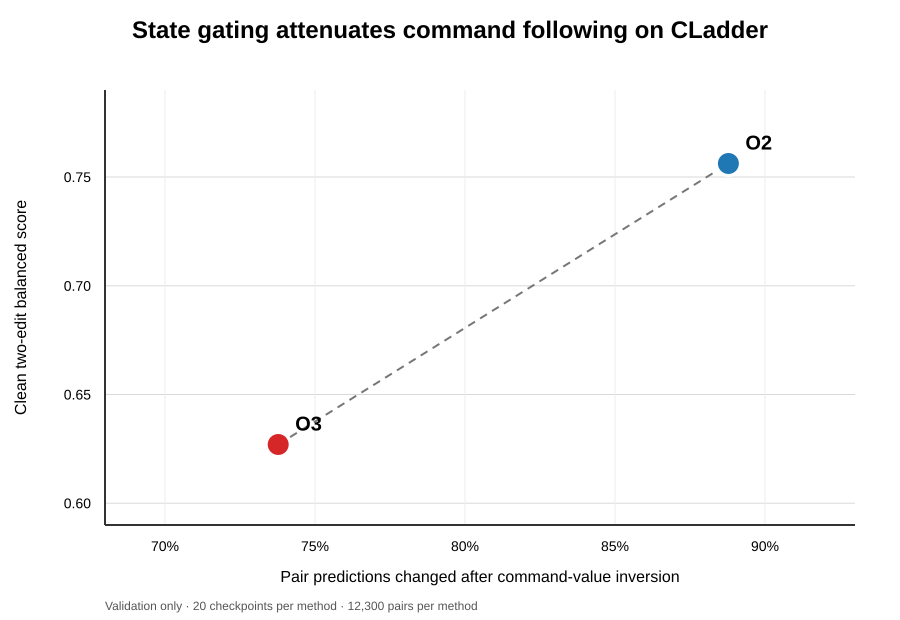

# Structured Causal Representation Editing in Encoder Models

## A comprehensive research report for the CORE 23-experiment program

**Status:** Paper-development report

**Evidence cutoff:** 12 September 2026

**Primary model:** BERT-base-uncased

**Evaluation regime:** preregistered development/validation experiments followed by a single held-out evaluation

---

## Abstract

This report audits whether a frozen language-model reader equipped with compact representation-level edits actually changes the requested causal state. CORE represents a world in latent slots, maps an intervention to a low-rank edit, and applies the edit inside a BERT encoder. Its strongest proposed operator, O3, is state-gated and regularized for identity, idempotence, commutation, and last-write-wins. A registered program of 23 experiment families compares O3 with prompting, matched LoRA, simpler operators, addressing interventions, deterministic floors, causal controls, robustness perturbations, and transfer tasks.

The strongest result is an evaluation indictment. In C2, a do-nothing system achieved 0.8507 variable accuracy, compared with 0.5138 for trained O3, showing that preservation-heavy accuracy can reward failure to execute an intervention. Trained O3 was only 0.0143 above random initialization with an interval including zero and 0.0032 below do-everything: it was not distinguishable from an untrained editor and lost to both deterministic floors. The clearest operator comparison is also negative for the original hypothesis: on validation CLadder, O2 scored 0.7562 and O3 scored 0.6270, a difference of 0.1292 in favor of O2. The command-inversion control supplies a mechanism for that gap: O2 changed 88.8% of pair predictions under value reversal, versus 73.8% for O3, so state gating attenuated command following while also lowering the clean score. O2 delivered roughly ten times more improvement per 10,000 trainable parameters. The law evidence is null or negative: L1's identical law-count outputs are non-diagnostic, L2 has no dropped-law interval excluding zero, L3 is partly degenerate by construction and otherwise null, and G2 records zero exact last-write agreement.

Addressing remains a strong mechanism result on XOR and WIQA: randomizing the target span reduced accuracy by 0.2906 and 0.2924 while pointer top-1 fell by 0.9685 and 0.8166. CLadder is a clear counterexample: task accuracy remained exactly 0.5194 even though pointer top-1 moved from 1.0000 to 0.9150, so the A1 decision was inert to the address change. A new positive control resolves the apparent tension with F2. Reversing both binary command values changed 10,920/12,300 O2 pair predictions and 9,074/12,300 O3 pair predictions across the 20 frozen checkpoints. Thus the F2 operator path is strongly command-value sensitive on CLadder even though the A1 encode-only addressing path is inert there. Because inverted-state gold was intentionally not used, this control establishes sensitivity rather than correctness in the inverted world. C3 is not an independent replication: it is the editor-zeroed ablation arm of these same F2 O3 cells. Its interpretable deltas are CLadder (+0.1065) and WIQA (+0.1239); its CCR.GB zeroed arm fails the ablation sanity check and is not used as an editor-effect estimate.

The one-shot held-out evaluation completed all 120 registered paper-scope cells. A1 reached 0.7659 accuracy on WIQA and chance-scale 0.4988 on CLadder. The CCR.GB arm was indistinguishable from a constant majority predictor: 0.9963 accuracy with macro-F1 0.4981, below the majority predictor's 0.4991. T2 reached 0.6099 balanced direction accuracy. T4's joint arm reached 0.6064, compared with 0.5071 for changing-only and 0.4571 for imagining-only. T5's O3-minus-baseline estimate was +0.0069 with a 95% interval crossing zero and is treated as no evidence of benefit.

Taken together, the evidence supports a narrower claim than originally proposed: causal-editor evaluations require explicit trivial floors, decision-sensitivity controls, target-success reporting, and split-aware provenance. O2 outperforms the more elaborate O3 where the strongest comparison is available, while the intended algebra is not demonstrated. The F2 positive control shows that its operator comparison measures command-conditioned execution rather than a command-inert path. The paper should therefore lead with measurement validity, followed by the O2 comparison and the bounded address-causality result.

## 1. Introduction

Language models can often answer questions that resemble causal reasoning, but a correct answer does not establish that the model internally represents or executes an intervention. A model may exploit lexical shortcuts, dataset imbalance, or ordinary conditional associations. This distinction matters whenever the desired computation is not merely “predict the likely answer” but “update a represented world under a specified action and propagate only the consequences licensed by the causal structure.”

The CORE program asks whether causal interventions can be implemented as explicit transformations of intermediate neural representations. The intended operator receives a representation of a factual world and a command such as setting a target variable to a new value. It should alter the target, propagate consequences to supported descendants, preserve unrelated variables, and compose predictably when multiple commands are applied. This is closer to an executable state transition than to ordinary text classification.

The program focuses on four desired laws:

1. **Identity:** a no-op intervention should leave the represented world unchanged.
2. **Idempotence:** applying the same intervention twice should equal applying it once.
3. **Commutation:** interventions on distinct, nonconflicting targets should commute when the structural model licenses independence of order.
4. **Last-write-wins:** for conflicting assignments to the same target, the final assignment should determine the target state.

These properties are attractive because they turn vague notions of “consistent editing” into testable relations among model outputs. They also reveal why ordinary single-edit accuracy is insufficient. A model may answer isolated questions correctly while failing under repeated, reordered, or conflicting edits.

The empirical program therefore separates five questions:

- Can intervention text reach the intended latent location?
- Does the edit change decisions rather than only hidden activations or loss values?
- Does the change improve causal state tracking while preserving unaffected variables?
- Do compositions obey the proposed algebraic laws?
- Do these benefits transfer across datasets, causal families, perturbations, and model sizes?

The 23 experiment families were designed to answer these questions through foundations (F), addressing (A), law tests (L), controls (C), transfer and robustness (T), and generalization (G). This report presents the current provenance-bound evidence used for scientific interpretation.

### 1.1 Research questions

**RQ1 — Operator advantage.** Does O3 outperform the simpler O2 operator, prompting, and parameter-matched LoRA on composed interventions?

**RQ2 — Address causality.** Does changing the intervention address cause a corresponding degradation in pointer behavior and task accuracy?

**RQ3 — Law compliance.** Do additional law constraints improve retention or direct law scores relative to reduced-law variants and random-initialization floors?

**RQ4 — Mechanistic necessity.** Does disabling the learned editor reduce performance, and does the answer depend on the editing architecture?

**RQ5 — Transfer.** Do the learned operators transfer across held-out structural-equation families, causal rungs, linguistic perturbations, native causal tasks, and biomedical evidence inference?

### 1.2 Contributions

This work contributes:

- a slot-based, addressable intervention interface for encoder representations;
- a 23-family experimental framework separating operator performance, addressing, laws, controls, transfer, and generalization;
- graph-level paired inference, deterministic floors, provenance-bound manifests, and a one-shot held-out protocol;
- evidence that explicit addresses causally influence predictions on XOR and WIQA, with CLadder as a decision-inert counterexample;
- evidence that O2 is stronger and substantially more parameter-efficient than O3 on validation CLadder;
- a direct demonstration that preservation-heavy metrics can rank a do-nothing system above a trained editor;
- a provenance-bound evidence base that preserves null findings without converting them into positive results.

## 2. Background and related literature

### 2.1 Causal reasoning and interventions

Structural causal models distinguish observation from intervention and counterfactual reasoning. The familiar causal hierarchy separates associational questions from actions and from counterfactual worlds; each higher level requires additional structure or assumptions. This distinction motivates CORE’s insistence on paired factual and intervened states rather than treating every causal-sounding sentence as an executable intervention. CLadder operationalizes formal causal reasoning in natural language by generating questions from causal graphs and oracle inference, while Corr2Cause tests whether models can infer causal relations from correlation descriptions. These benchmarks demonstrate that linguistic fluency and causal validity are not interchangeable ([CLadder](https://arxiv.org/abs/2312.04350); [Corr2Cause](https://arxiv.org/abs/2306.05836)).

WIQA provides a complementary procedural setting. It contains paragraphs, influence graphs, and “what if” questions about how perturbations affect processes. Its original release contains roughly 40,000 questions and highlights the difficulty of tracing chains of influence through text ([Tandon et al., 2019](https://aclanthology.org/D19-1629/)). CORE uses this graph grounding to connect textual targets to latent slots and to separate changed variables from variables that should be preserved.

CSuite provides synthetic datasets generated from known structural equation models, with explicit graphs and interventional data. Its controlled SEM families are valuable for out-of-distribution tests because ground truth can be recomputed rather than inferred from prose ([CSuite repository](https://github.com/microsoft/csuite)). Evidence Inference 2.0 supplies a different real-text transfer setting: given a clinical-trial article and an intervention-comparator-outcome prompt, the task is to infer whether the intervention significantly increases, decreases, or does not change the outcome. The dataset is article-grouped and evidence-grounded, making leakage control essential ([DeYoung et al., 2020](https://aclanthology.org/2020.bionlp-1.13/)).

### 2.2 Pretrained encoders and parameter-efficient adaptation

BERT is a bidirectional Transformer encoder pretrained by conditioning on left and right context, then adapted to downstream tasks with comparatively small task-specific heads ([Devlin et al., 2019](https://research.google/pubs/bert-pre-training-of-deep-bidirectional-transformers-for-language-understanding/)). In CORE, BERT is not merely a classifier: the encoder is split at an internal layer, where a structured intervention modifies latent world slots before upper-layer decoding.

LoRA freezes pretrained weights and injects trainable low-rank matrices, greatly reducing the parameters needed for adaptation ([Hu et al., 2021](https://arxiv.org/abs/2106.09685)). It is a critical comparison because CORE’s operators are also low-rank and parameter-efficient. A fair test must therefore rematch LoRA rank to the complete trainable parameter count of the proposed editor, including its pointer projections.

Representation Finetuning (ReFT) directly learns interventions on hidden representations while freezing the base model. LoReFT reports strong parameter efficiency relative to LoRA across multiple tasks ([Wu et al., 2024](https://proceedings.neurips.cc/paper_files/paper/2024/hash/not-published-Abstract-Conference.html)). Activation steering similarly modifies intermediate activations at inference time, often using directions derived from contrastive prompts ([Turner et al., 2023](https://arxiv.org/abs/2308.10248)). CORE belongs to this broad family but differs in conditioning edits on an explicit intervention, a target address, and a represented world state.

### 2.3 Model editing

Model editing methods seek targeted behavioral updates while preserving unrelated behavior. ROME locates and modifies factual associations through rank-one changes to feed-forward weights ([Meng et al., 2022](https://arxiv.org/abs/2202.05262)); MEMIT extends this idea to many memories ([Meng et al., 2023](https://arxiv.org/abs/2210.07229)); and MEND learns auxiliary networks that transform gradients into rapid edits ([Mitchell et al., 2022](https://arxiv.org/abs/2110.11309)). These methods primarily edit model parameters or factual associations. CORE instead executes temporary, input-conditioned changes to a structured hidden world. Nevertheless, the same evaluation concerns recur: efficacy alone is not enough; specificity, preservation, compositionality, and robustness must also be measured.

### 2.4 Causal abstraction and representation alignment

Distributed Alignment Search treats interpretability as alignment between high-level causal variables and subspaces of neural representations. Boundless DAS relaxes fixed subspace dimensionality and searches for distributed alignments ([Geiger et al., 2024](https://proceedings.mlr.press/v236/geiger24a/geiger24a.pdf)). CORE’s explicit slots and pointers pursue a more engineered alignment: variables are represented in named slots, and textual spans are mapped to those slots. A3 tests whether this engineered alignment is behaviorally causal rather than merely decodable.

### 2.5 Gap addressed by this work

Prior work demonstrates that hidden representations can be steered and facts can be edited, but it does not guarantee that a learned edit behaves like a causal state transition under composition. CORE’s distinctive contribution is the combination of explicit target addressing, state-conditioned low-rank editing, structural support, algebraic law tests, deterministic floors, and graph-level inference. The present results also show why this stricter framework is necessary: without it, a method can appear successful because it preserves most variables, exploits label imbalance, or changes losses without changing decisions.

## 3. System and operator design

### 3.1 World representation

The reader encodes a textual description, graph information, factual variable values, and a query. Up to 16 editable world tokens represent the latent state. For graph widths below 16, inactive positions are masked. A variable head predicts per-slot state, while a task head or causal readout maps the post-edit state to the answer vocabulary.

The encoder is split at an internal layer. Lower layers construct the world representation; an operator edits selected slot states; upper layers decode the revised state. Layer placement was explored during development, but the layer sweep is not treated as a scientific result.

### 3.2 Addressing variants

A1 compares six interfaces:

| Arm | Description | Intended role |
|---|---|---|
| T0 | Learned intervention ID | Synthetic reference ceiling; XOR only |
| T1 | Separate text encoder for the command | Text-conditioned reference |
| T2-b | Inline command used only to encode an edit, then masked | Encode-only intervention |
| T2-a | Naive inline command | Leakage-prone ablation |
| T3-b | Text span mapped through a pointer to a latent slot | Explicit addressable editor |
| T3-a | Span-conditioned edit applied broadly | Non-pointer address ablation |

T3-b uses query and key projections to score candidate slots. The current path uses grounded slot names, masks direct target markers from the ordinary reader trunk, applies hard pointer selection, restricts edit support to the selected target and structural descendants, and prevents post-edit cross-slot mixing that would bypass the declared edit support.

### 3.3 Operators

The primary operator families are:

- **Prompting:** the command is exposed through ordinary full attention; no addressed editor is applied.
- **Matched LoRA:** a conventional low-rank adaptation whose rank is selected to approximate the complete trainable parameter budget of T3-b/O3.
- **O1:** a canonical fixed intervention-specific transformation.
- **O2:** a conditional low-rank additive operator driven by the intervention representation.
- **O3:** a state-gated conditional low-rank operator driven by both the intervention and the current latent world.

O3 uses rank 16 over a 16-token world interface. The frozen four-law profile gives equal weight to identity, idempotence, commutation, and last-write-wins; no post hoc law-profile search is permitted in formal cells.

### 3.4 Composition and scoring

Two commands are executed in order, followed by one final decode. Outcomes are decomposed into:

- **change accuracy:** correctness on variables that should change;
- **preservation accuracy:** correctness on variables that should remain unchanged;
- **target success:** correctness at the addressed target;
- **balanced intervention score:** the unweighted balance of change and preservation behavior;
- **record exact match:** whether the complete predicted state is correct;
- **pointer top-1:** whether the highest pointer score selects the authoritative target slot.

Balanced scoring was introduced because raw variable accuracy can be dominated by preserved variables. C2 shows that even balanced task design requires explicit trivial floors.

## 4. Data

### 4.1 Datasets and roles

| Source | Role in the program | Key property | Final disposition |
|---|---|---|---|
| XOR SCMs | Controlled training, composition, and law tests | Exact executable truth and graph-disjoint generation | Used for development and validation |
| CCR.GB | Large controlled real-family intervention set | 36,000 records | Used, but accuracy interpreted with macro-F1 because of imbalance |
| CLadder | Formal causal reasoning in natural language | Executable graph-based causal questions | Used; strongest O2-vs-O3 evidence |
| WIQA | Procedural perturbation reasoning | Text grounded by influence graphs | Used; strong addressing and editor-ablation evidence |
| CSuite | Synthetic SEM transfer | Known graphs and interventional ground truth | Used for T2 and T4 |
| Corr2Cause | Native causal-relation robustness | Correlation-to-causation classification | Auxiliary/native task only |
| Evidence Inference 2.0 | Biomedical transfer | Article-grouped ICO prompts and evidence | Used for G4 |
| CRASS / CounterBench | Native causal task candidates | Task-specific labels and adapters | Used in T5 candidate transfer |

### 4.2 Generated data

Seven generated artifacts were validated: 93,600 C1 control records, 7,200 C2 floor cases, 15,000 T2 CSuite pairs, 45,000 T4 rung views, 5,050 T5 source-native rows, 120,000 G2 ordered sequences, and 2,141 adjudicated G4 prompts derived from 4,077 valid annotations across 817 articles. The generated total was 289,927 source-level rows.

T2 and T4 use 15 CSuite SEM families partitioned by whole graph group. The split contains 11 training families, 2 validation families, and 2 locked test families. T2 contains 11,000/2,000/2,000 train/validation/test rows; T4 contains 33,000/6,000/6,000 rung views. Record identifiers were verified to have zero overlap across splits.

### 4.3 Annotation and adjudication

For sources that required paired interventions, the project used source-grounded annotation rules: annotators could transcribe and normalize explicit causal structure but could not invent edges, structural equations, intervention values, or counterfactual outcomes. Two independent WIQA annotations were validated against the same signed queue, disagreements were blinded, and adjudication was applied only to the disagreement set. The frozen authoritative WIQA result contained 70 accepted validation rows with no test access.

The lesson from this process is methodological: natural-language causal data are not automatically executable intervention data. A causal statement, correlation, or question can be useful for a native task while remaining inadmissible for paired-world evaluation.

## 5. Experimental methodology

### 5.1 Preregistration and provenance

Each formal experiment was defined by a machine-readable manifest specifying model, method, data hashes, graph units, seeds, split restrictions, output paths, and finalization conditions. Cell reports bind checkpoint, artifact, contract, and manifest hashes. Only completed, contract-matching outputs enter the analyses below.

Architecture screening and confirmatory inference were separated. A1 used 130 five-seed screening cells to choose T3-b, then reran a frozen 520-cell confirmatory matrix over 20 seeds. The selection was not reopened after confirmatory results.

### 5.2 Compute

BERT-base jobs used exactly four distributed ranks per cell. Up to eight independent cells ran on 32 GPUs. BERT-large used eight GPUs because fixed-workload validation measured higher throughput on eight than on sixteen devices. GPU allocation was optimized for throughput and safe memory headroom rather than an artificial requirement to fill all VRAM.

### 5.3 Statistical unit and uncertainty

The graph—not the individual row—is the primary experimental unit whenever graph-level predictions are available. Paired comparisons report Student-t 95% intervals across matched seeds or graph units and deterministic paired bootstrap intervals. A result is not called reliable merely because its point estimate has the desired sign. Where the two interval procedures disagree, both are retained.

WIQA is an exception to the intended graph-level design: its 70-row analysis contains approximately one item per graph. Those estimates are therefore row-limited and cannot establish within-graph robustness or support the same graph-level inference available on CLadder.

### 5.4 Multiplicity

No experiment-wide multiplicity correction was preregistered despite the large comparison family. A post hoc Holm correction was therefore applied to the seven contrasts considered for headline use in this reframing:

| Contrast | Unadjusted p | Holm-adjusted p | Disposition |
|---|---:|---:|---|
| A3 XOR correct − random address | 2.87×10⁻²³ | 2.01×10⁻²² | Survives |
| A3 WIQA correct − random address | 2.46×10⁻²¹ | 1.47×10⁻²⁰ | Survives; row-limited |
| C3 WIQA full − zeroed | 1.59×10⁻¹³ | 7.95×10⁻¹³ | Survives; row-limited |
| F2 CLadder O2 − O3 | 1.07×10⁻⁹ | 4.27×10⁻⁹ | Survives |
| C3 CLadder full − zeroed | 5.13×10⁻⁸ | 1.54×10⁻⁷ | Survives |
| G1 O3 − baseline | 0.1369 | 0.2738 | Null |
| T5 O3 − baseline | 0.2937 | 0.2937 | Null |

This family and correction were defined after the evidence audit, so the adjusted values are sensitivity analyses rather than preregistered confirmatory tests. Small directional estimates are not interpreted as evidence.

### 5.5 Validation and test discipline

Development, architecture selection, ablation, and confirmatory experiments were validation-only and recorded `test_evaluated=false`. The held-out manifest was registered against the original operator hypothesis and consumed before the evaluation-audit framing emerged. It covers A1, T2, T4, and T5, but not six of the seven tables now recommended for the reframed paper, including the central O2-versus-O3 comparison. Every paper table must therefore label its evidence regime explicitly. The final evaluator completed 120/120 registered cells without rerunning completed outputs. The final manifest SHA-256 is `not-published`.

### 5.6 The 23-experiment design

| # | ID | Purpose | Principal comparison |
|---:|---|---|---|
| 1 | F1 | Foundational XOR operator comparison | O3 − O2 |
| 2 | F2 | Multi-family method sweep | prompting, matched LoRA, O2, O3 |
| 3 | F3 | Causal versus placebo structure | real − noncausal under shared selection |
| 4 | F4 | Reader-scale test | O3 − O2 across BERT sizes |
| 5 | A1 | Addressing architecture | T0/T1/T2/T3 variants |
| 6 | A2 | T2-b masking and editor contribution | active, zeroed, no-instruction, prompting |
| 7 | A3 | Pointer causality | correct, adjacent, random address |
| 8 | L1 | Law-count retention | one, three, four laws plus floors |
| 9 | L2 | Law ablation | full versus one-law-dropped variants |
| 10 | L3 | Cross-method law compliance | eight methods versus matched random init |
| 11 | C1 | Closing controls | real, noncausal, shuffled |
| 12 | C2 | Floor calibration | trained O3 versus three trivial floors |
| 13 | C3 | O3 editor necessity | full versus editor-zeroed |
| 14 | C4 | Parameter accounting | gain per 10k trainable parameters |
| 15 | T1 | Composed-pair measurement | prompting, O2, O3 |
| 16 | T2 | Held-out SEM-family transfer | O3 direction prediction |
| 17 | T3 | Linguistic robustness | clean versus rename/paraphrase |
| 18 | T4 | Causal-rung transfer | changing, imagining, joint |
| 19 | T5 | Native-task candidate transfer | baseline versus O3 |
| 20 | G1 | CLadder estimand candidate transfer | baseline versus O3 |
| 21 | G2 | Sequential consistency | last-write hidden-state agreement |
| 22 | G3 | Edit-layer selection | layers 1–11 |
| 23 | G4 | Biomedical evidence transfer | baseline versus O3 |

## 6. Results

### 6.1 Foundation: F1 and F2

**Evidence regime: validation only.** F1 completed 40 XOR cells. O2 scored 0.5016 and O3 scored 0.5069, for a paired O3−O2 delta of +0.0052. Both the Student-t interval [-0.0032, 0.0137] and graph-bootstrap interval [-0.0005, 0.0143] included zero. F1 therefore provides no reliable evidence that O3 is better than O2.

F2 supplies the clearest method comparison on real families:

| Family | Prompting | Matched LoRA | O2 | O3 | Main interpretation |
|---|---:|---:|---:|---:|---|
| XOR | 0.5079 | 0.5036 | 0.5083 | 0.5093 | All near chance; no meaningful separation |
| CCR.GB | 0.5403 | 0.6281 | **0.8047** | 0.6370 | Imbalanced-label result; not a headline efficacy comparison |
| CLadder | 0.5015 | 0.6055 | **0.7562** | 0.6270 | O2 beats O3 by 0.1292; principal real-family result |
| WIQA | 0.4892 | 0.5660 | **0.6644** | 0.6239 | O2 exceeds O3 and prompting |

On CLadder, O2 exceeded prompting by 0.2547, while O3 exceeded prompting by 0.1256; both intervals excluded zero. On WIQA, the corresponding gains were 0.1752 and 0.1347, but the 70-row, approximately one-item-per-graph design limits that comparison. These results show that learned intervention modules can beat prompting on validation CLadder, but they reject the stronger claim that the state-gated, four-law O3 formulation is best.

#### Qwen2.5-7B scale extension

A preregistered validation-only extension replaced the BERT representation with frozen Qwen2.5-7B-Instruct final-layer features while retaining the same O2 and O3 mathematical operators. Across 20 paired seeds (401–420), O2 scored 0.7705 and O3 scored 0.7427 on the 615 CLadder composed pairs. The paired O2−O3 difference was +0.0277, 95% Student-t interval [+0.0207,+0.0348]. Thus the main architectural ordering replicated at 7B scale, although the 7B result is a frozen-backbone operator probe rather than full-model fine-tuning.

Both 7B paths passed the inversion sensitivity control: O2 and O3 changed 88.78% and 89.37% of pair vectors. O2's retained-gold score fell by 0.5322, versus 0.4785 for O3. The state gate therefore attenuated the magnitude of command reversal without making the path inert, but that attenuation did not improve clean accuracy. The do-nothing floors were 0.4990 and 0.5079. O2 used 154,112 operator parameters; O3 used 25,905,152.

### 6.2 Addressing: A1, A2, and A3

#### A1 architecture and confirmatory results

A1 completed 130 screening cells and 520 confirmatory cells. **These are validation results.** T3-b was frozen because it led XOR screening at 0.5369 and exceeded T0 by 0.0102 within the preregistered rule. In confirmatory validation, T3-b scored:

| Family | T3-b balanced score | Change | Preservation | Target success | Composed-eval pointer top-1 |
|---|---:|---:|---:|---:|---:|
| XOR | 0.5315 | 0.5656 | 0.4975 | 0.8951 | 1.0000 |
| CLadder | 0.4990 | 0.4864 | 0.5117 | 0.4961 | 0.2636 |
| WIQA | 0.7022 | 0.4251 | 0.9792 | 0.2300 | 0.9661 |

The confirmatory XOR delta over T0 was +0.0104, with Student-t 95% interval [+0.0077, +0.0132] and graph-bootstrap interval [+0.0077, +0.0131]. These values are taken directly from `A1_CONFIRMATORY.json`; the previously reported A1 table was unsourced and has been replaced. The canonical A1 CCR.GB result is omitted from the scientific table because its change accuracy was 0.0154 against preservation 0.9909 and target success 0.0167, a no-op signature rather than efficacy evidence.

The CLadder pointer values across evaluation regimes are not the same measurement. Confirmatory validation reports pointer top-1 over the composed two-edit evaluator (615 composed examples across 20 graph units), whereas the final one-shot runner calls `evaluate_exact` on 166 sealed single-edit benchmark rows per seed. The shift from 0.2636 to 0.9970 therefore reveals evaluator-path sensitivity, not improved held-out generalization, and neither value may be used to explain the other. A3's 1.0000 correct-address value is a third, 147-row single-view control artifact. This protocol mismatch is now an explicit limitation.

#### A2 masking and T2-b editor contribution

A2 completed its frozen-checkpoint measurements, but the decision outputs were bit-identical across active and control paths in most families. The equality makes the masking comparison non-diagnostic rather than a positive result. A2 is retained only as evidence that a decision-sensitivity gate is necessary; it contributes no efficacy or robustness claim.

#### A3 causal addressing controls

A3 completed 300 frozen-checkpoint **validation** measurements:

| Family | Correct accuracy | Random accuracy | Random − correct | Correct pointer | Random pointer |
|---|---:|---:|---:|---:|---:|
| XOR | 1.0000 | 0.7094 | **-0.2906** | 1.0000 | 0.0315 |
| CCR.GB | 0.9965 | 0.8301 | **-0.1664** | 1.0000 | 0.2338 |
| WIQA | 0.7502 | 0.4578 | **-0.2924** | 0.9661 | 0.1495 |
| CLadder | 0.5194 | 0.5194 | 0.0000 | 1.0000 | 0.9150 |

Address corruption causes large prediction changes on XOR and WIQA, establishing bounded evidence that the learned address is behaviorally active. The CCR.GB change is not treated as task-efficacy evidence because the label distribution supports constant behavior. CLadder is an explicit inertness result: pointer top-1 moved from 1.0000 to 0.9150 but task accuracy remained exactly 0.5194.

### 6.3 Laws: L1, L2, and L3

L1's one-, three-, and four-law variants produced identical decision scores despite distinct checkpoints. That signature is non-diagnostic, so L1 cannot establish either benefit or neutrality of the additional laws.

L2 completed 320 validation-only cells over XOR and CLadder. It compared the full four-law objective with four dropped-law variants across twenty paired seeds. None of the eight family-by-dropped-law balanced-score intervals excluded zero. On CLadder, all four full-minus-dropped means were exactly zero; on XOR they ranged from +0.000000 to +0.000055. L2 therefore supplies no evidence that retaining any single registered law objective improves the selected-checkpoint balanced score. The frozen summaries do not retain per-graph predictions, so the aggregate reports paired-seed inference and explicitly withholds graph-level intervals.

L3 completed 40 cells across prompting, matched LoRA, LoReFT, task-vector addition, router, O1, O2, and O3. Its identity column is not uniformly testable: prompting, task-vector addition, router, O1, O2, and O3 have exactly zero trained-minus-random identity differences by construction, while prompting is non-diagnostic on all four laws because it has no fitted editor to distinguish from its matched random twin. Only matched LoRA and LoReFT produce non-degenerate identity estimates, and neither interval excludes zero. Across the remaining non-identity comparisons, no Student-t interval excludes zero. L3 therefore provides no positive law evidence without treating structural zeros as failed tests.

#### G2: direct decision-level last-write test

G2 is the program's sharpest direct test of a proposed law. It evaluates whether sequential conflicting writes produce the exact hidden decision state required by last-write-wins. Both O2 and O3 achieved zero exact agreement under the registered criterion. This is an outright failure of the law test, not an uncertain directional estimate, and it is the principal law result. L1 remains non-diagnostic, L2 is null, and L3 is partly degenerate and otherwise null; G2 directly rejects exact last-write compliance.

### 6.4 Closing controls: C1–C4

**Evidence regime: validation only.** These controls were not part of the consumed one-shot test.

#### C1: causal, placebo, and shuffled controls

Across 60 cells, mean scores were 0.5004 for real, 0.4978 for noncausal placebo, and 0.4916 for shuffled. The primary real−placebo delta was +0.0026, with Student-t interval [-0.0062, 0.0114] and graph bootstrap [-0.0048, 0.0111]. O3 did not reliably distinguish causal from placebo structure.

#### C2: trivial floors

| Method | Variable accuracy | Interpretation |
|---|---:|---|
| Do nothing | **0.8507** | Dominates because most variables are preserved |
| Do everything | 0.5170 | Near trained O3 |
| Random init | 0.4995 | Chance-scale floor |
| Trained O3 | 0.5138 | Far below do-nothing; not reliably above random |

Trained O3 minus do-nothing was -0.3369, with both intervals excluding zero. Trained O3 minus random init was +0.0143, but both intervals included zero. This is the clearest demonstration that unbalanced variable accuracy is not a valid efficacy metric for intervention editing.

Trained O3 also scored 0.0032 below do-everything. Put plainly, the trained causal editor was not distinguishable from an untrained editor and lost to both deterministic trivial floors. That comparison is stronger than the preservation-imbalance diagnosis alone and should be displayed beside every reported editor score.

The held-out CCR.GB classifier supplies a parallel constant-predictor check:

| Held-out CCR.GB system | Accuracy | Macro-F1 | Interpretation |
|---|---:|---:|---|
| A1 model | 0.9963 | 0.4981 | Indistinguishable from constant prediction |
| Majority-class floor | 0.9963 | 0.499073 | Arithmetic constant-predictor reference |

The model is slightly below the constant predictor on the class-balanced diagnostic. This arm is a floor result, not evidence of causal efficacy.

#### C3: F2 O3 editor-ablation arm

C3 is derived from the same full O3 cells reported in F2: its full-O3 column is identical to F2 by construction. It is therefore an ablation arm of F2, not an independent experiment or replication. C4 parameter accounting is derived from the same fitted cells.

The interpretable O3 editor ablations are:

| Family | Full O3 | Editor zeroed | Delta | 95% Student-t interval |
|---|---:|---:|---:|---:|
| CLadder | 0.6270 | 0.5205 | **+0.1065** | [+0.0807, +0.1323] |
| WIQA | 0.6239 | 0.5000 | **+0.1239** | [+0.1097, +0.1380] |
| XOR | 0.5093 | 0.5068 | +0.0025 | [-0.0021, +0.0072] |

CCR.GB is not included in the ablation table: its zeroed arm scored 0.2991, below the 0.5 chance floor and exactly matching the earlier A2 value to six decimals. That control does not isolate “O3 without its editor.” The defensible CCR.GB comparisons are O3 versus prompting (+0.0967) and O3 versus matched LoRA (+0.0089), both validation-only and subject to the dataset's imbalance. C3 therefore establishes decision relevance only on CLadder and WIQA.

#### C4: parameter efficiency

The complete T3-b module contains 2,999,040 trainable parameters in BERT-base and 5,309,440 in BERT-large. Instantiated matching selected LoRA rank 81 for base and 54 for large. In the F2 task-specific cells, O2 used only 234,240 parameters on CLadder, compared with 1,242,624 for O3. O2’s gain over prompting per 10,000 parameters was 0.01088, versus 0.00101 for O3: approximately 10.8 times greater. The same accounting can be computed for other families, but CCR.GB is excluded from the efficacy claim because of label imbalance and WIQA remains row-limited. The defensible parameter-efficiency conclusion is therefore specific to validation CLadder.

### 6.5 Transfer and robustness: T1–T5

**T1, T3, G1, G2, G4, and the development portions of T2, T4, and T5 are validation-only.** T1's provenance-matched summaries show the same ordering. On CLadder, O2 scored 0.7562 and O3 0.6270, while prompting scored 0.5015. On WIQA the values were 0.6644, 0.6239, and 0.4892, subject to the row-limited caveat. O2 remained stronger than O3, while XOR differences were negligible.

The F2 CLadder instruction-sensitivity control completed 40 validation-only cells: 20 seeds for each of O2 and O3, using the exact frozen readers and fitted operators underlying F2/C3. Both binary command values in each composed pair were inverted while the original gold was retained solely to measure sensitivity. O2 changed 10,920/12,300 pair-level prediction vectors (88.8%) and 30,142/46,260 individual variable decisions (65.2%); its retained-gold balanced score fell from 0.7562 to 0.2385. O3 changed 9,074/12,300 pair vectors (73.8%) and 26,092/46,260 variable decisions (56.4%); its score fell from 0.6270 to 0.3543. The F2 operator path is therefore strongly responsive to the requested value. More importantly, O2 is above O3 on both clean score and inversion-induced movement: state gating attenuates command following, providing a measured mechanism for O3's loss rather than merely documenting that the elaborate operator lost. This supports a sharp distinction between the inert A1 encode-only path and the live F2 operator path. The control does not score correctness in the inverted world.

**Figure 1.** O2 lies above O3 on both clean performance and the fraction of pair predictions changed after command-value inversion. The plot is a sensitivity diagnostic, not an inverted-world correctness score.

T2 completed five CSuite held-out-family cells. Validation balanced direction accuracy was 0.4705 overall: 0.2500 on `nonlingauss` and 0.5305 on `symprod_simpson`. The one-shot held-out result improved to 0.6099 balanced direction accuracy, with change accuracy 0.4061 and preservation 0.8137. Across five seeds the interval was wide, reflecting unstable generalization.

T3 yields no robustness evidence. All 20 clean-versus-paraphrase seed pairs had exactly zero accuracy movement, and all 2,880 matched task and variable prediction vectors were bit-identical; only floating-point losses moved. The registered follow-up inverted every binary command value while preserving the target and changed 0/2,880 task predictions and 0 variable predictions across the same 20 checkpoints. The instruction path is decision-inert in this evaluation, so the paraphrase result is void. Structural-variable renaming changed decisions but had an uncertain mean accuracy effect of -0.1431, 95% interval [-0.3524, 0.0663], and is not promoted as a robustness result.

T4 completed 15 development cells. Joint training scored 0.5884, changing-only 0.5621, and imagining-only 0.5384. On the held-out split, joint again ranked first at 0.6064, versus 0.5071 and 0.4571. No paired significance analysis among arms is present, so this ordering is descriptive rather than evidence of benefit.

T5 completed 40 development cells and 40 held-out cells. Development O3−baseline was +0.0139 with interval [-0.0084, 0.0363]. Held-out baseline accuracy was 0.4486, O3 accuracy 0.4555, and the paired delta was +0.0069 with interval [-0.0065, 0.0203]. There is no reliable transfer advantage.

### 6.6 Generalization: G1–G4

G1's O3−baseline candidate-transfer delta was +0.0247, with interval [-0.0086, 0.0581], and is treated as null. G2's promoted direct last-write failure is detailed in §6.3. G3 contributes no scientific claim. G4's Evidence Inference delta was -0.0011, with interval [-0.0036, 0.0014], providing no evidence of biomedical transfer benefit.

### 6.7 One-shot held-out evaluation

All 120 **admissible, scored** final cells completed with four ranks per cell and zero runtime failures. This count does not imply complete coverage of every originally contemplated arm: A1 XOR was registered but unscored because the sealed file lacked model inputs and overlapped architecture-selection graphs, and the excluded open-text source was outside the final evaluator's admissible scope.

| Family | Held-out result | Interpretation |
|---|---|---|
| A1 CLadder | Accuracy 0.4988 [0.4865, 0.5111] | Chance-scale; pointer location alone is insufficient |
| A1 WIQA | Accuracy 0.7659 [0.7375, 0.7944] | Strongest credible A1 task result; pointer top-1 0.9726 |
| T2 | Balanced direction 0.6099 | Better preservation than change; unstable across seeds |
| T4 changing-only | 0.5071 | Near chance-scale |
| T4 imagining-only | 0.4571 | Below changing-only |
| T4 joint | **0.6064** | Best T4 arm |
| T5 baseline | 0.4486 | Reference |
| T5 O3 | 0.4555 | No evidence of improvement |

Three principal held-out point estimates exceeded their validation counterparts: T2 by +0.1394, A1 WIQA by +0.0707, and T4 joint by +0.0180. The held-out graph/family groups were isolated but not difficulty-matched to validation. The most plausible interpretation is that these held-out groups were easier, not that test access improved the models; the upward shift is disclosed as a comparability limitation.

## 7. Analysis

### 7.1 The original operator hypothesis is not supported

The original strong hypothesis was that a state-gated operator trained with four causal-edit laws would outperform simpler alternatives because its inductive bias better matches intervention semantics. Three findings oppose that claim; the first two are two views of the same F2 cells rather than independent replications:

1. O2 beats O3 by 0.1292 on validation CLadder.
2. O2 produces much more gain per trainable parameter.
3. L1 is non-diagnostic, L2 is null, L3 is partly degenerate and otherwise null, and G2 fails exact last-write agreement.

The correct conclusion is not that representation editing never works. The F2 inversion control proves that both operators respond strongly to command value on CLadder. C3—the zeroed arm of the same F2 O3 cells—shows that the fitted O3 component contributes materially on CLadder and WIQA, and both O2 and O3 beat prompting on validation CLadder. The conclusion is narrower: state gating plus the four registered law penalties did not improve enough to justify their complexity and did not produce the predicted superiority over O2.

### 7.2 Addressing is necessary but not sufficient

A3 shows a convincing causal chain on XOR and WIQA: corrupting the address collapses pointer accuracy and degrades task accuracy. This is stronger than a correlational probe because the intervention changes only the address while reusing frozen checkpoints and records.

However, CLadder demonstrates the limit of this mechanism result. Pointer top-1 moved from 1.0000 to 0.9150 while task accuracy remained exactly 0.5194. The pointer changed and the decision did not: this is decision inertness, not evidence of task sensitivity. Addressing should therefore be reported as a bounded mechanism result, not as proof of full causal reasoning.

### 7.3 Ablations require fidelity checks

A2's bit-identical outputs are not evidence of robustness or successful masking; they show why every ablation needs a positive decision-sensitivity control. The F2 command inversion supplies that control for its CLadder operators: O2 and O3 move 88.8% and 73.8% of pair prediction vectors. C3 supplies a usable within-F2 ablation on CLadder and WIQA because removing the editor changes decisions without driving the model below a basic floor. Its CCR.GB zeroed arm fails that fidelity test and is not an editor-effect estimate.

The synthesis is therefore more precise than “the editor changes the answer, but not because of what was asked.” That statement applies to the inert A1 CLadder path, not to F2. In F2, the operator demonstrably changes decisions according to the requested binary value. The remaining failure is that the more elaborate, law-regularized O3 is worse than O2, does not beat the registered trivial floors in C2, and does not satisfy the direct law tests.

### 7.4 Preservation can masquerade as causal competence

C2 exposes the central metric hazard. If most variables should remain unchanged, a do-nothing system can achieve very high variable accuracy while never executing an intervention. This is why CORE separates change, preservation, and target success and uses a balanced intervention score. Even balanced scores should be accompanied by exact-match and trivial floors because a system may trade complete failure on changes for near-perfect preservation.

The CCR.GB held-out result illustrates the same issue. Accuracy of 0.9963 sounds decisive, but macro-F1 of 0.4981 is below the 0.499073 achieved by a majority-class predictor at the observed prevalence. The result is indistinguishable from constant prediction and belongs with the floor analysis, not the efficacy claims.

### 7.5 Transfer is selective and unstable

The transfer families do not support broad universality. T4's joint arm ranks first, but T2 varies sharply by SEM family and seed. T5, G1, and G4 have intervals crossing zero and are treated as null, including after considering the uncorrected multiplicity burden. G2 fails exact hidden-state consistency. These outcomes suggest that operator training captures task-specific regularities more readily than abstract causal transition laws.

### 7.6 Null and diagnostic results are part of the contribution

This program produced several measurement lessons that are useful beyond CORE:

- distinct checkpoints can yield identical decisions when an editing interface is inert;
- paraphrase robustness is non-diagnostic unless a meaning-reversing instruction changes decisions;
- a pointer can be accurate without making the downstream answer address-dependent;
- law losses can be finite without producing law-consistent decisions;
- overall accuracy can be dominated by preservation or class imbalance;
- a causal-sounding dataset may not contain executable paired interventions;

These are not merely engineering inconveniences. They are threats to validity in representation editing and causal-language evaluation.

## 8. Discussion

### 8.1 What can be claimed

The evidence supports four claims:

1. Explicit textual addressing can identify prediction-relevant latent locations on XOR and WIQA in a split BERT encoder.
2. On validation CLadder, learned low-rank operators outperform prompting and respond strongly when the requested binary values are reversed.
3. The simpler O2 operator is stronger and more parameter-efficient than the proposed O3 operator on validation CLadder.
4. Evaluation without editor ablations, changed/preserved decomposition, and trivial floors can substantially overstate causal editing ability.

### 8.2 What cannot be claimed

The evidence does not support claims that:

- O3 is universally better than O2;
- the four laws are learned in a behaviorally meaningful way;
- high CCR.GB accuracy reflects near-perfect causal reasoning;
- performance transfers reliably across causal families or biomedical evidence tasks;

### 8.3 Implications for model design

The O2 result suggests that intervention-conditioned low-rank addition may be a better bias than state-gated editing for the current data scale and reader. O3’s extra parameters and state dependence can increase variance or make optimization harder without adding useful structure. Future operators should earn complexity through predeclared ablations, parameter-normalized comparisons, and direct decision-level law tests.

The A3 result suggests retaining explicit pointers. Yet the pointer should be trained and evaluated jointly with address counterfactuals: correct, adjacent, random, and adversarial spans. A future architecture should make the addressed slot the only route by which target identity reaches the causal decoder, while verifying that no passage marker, query wording, or slot name provides a bypass.

### 8.4 Implications for evaluation

Every causal editor benchmark should include:

- do-nothing, do-everything, and random-init floors;
- editor-active versus editor-zeroed comparisons;
- change, preservation, target, and exact-state metrics;
- address corruption controls when an address is used;
- graph- or scenario-level inference rather than treating correlated rows as independent;
- split checks at the graph/article/world level;
- a clear distinction between validation and held-out test evidence.

These requirements are more important than adding another dataset. The primary risk is not insufficient benchmark diversity but mismeasurement.

### 8.5 Publication framing

The most defensible paper leads with the evaluation result:

> **When causal editors do nothing: floors, sensitivity controls, and provenance in representation editing.**

Under this framing, C2 is the lead result, the O2-versus-O3 CLadder comparison is the principal operator result, and address dependence is a bounded mechanism result. The law hypothesis remains in the body as explicitly tested and rejected, not in the title.

## 9. Limitations and threats to validity

### 9.1 Model scope

Most formal cells use BERT-base, a 110M-parameter encoder. The targeted Qwen2.5-7B extension replicates the CLadder O2-over-O3 ordering with a frozen instruction-tuned decoder backbone, but it is not a complete replication of every family and does not fine-tune the 7B backbone. BERT-large appears only in infrastructure and parameter-accounting components.

### 9.2 Data scope

XOR and CSuite are synthetic and offer exact truth but limited linguistic realism. CLadder and WIQA are richer, yet their graph structures and label distributions differ. CCR.GB is severely imbalanced. Evidence Inference measures comparative outcomes in clinical trials but is not an executable SCM benchmark. These sources should not be pooled into one universal causal score.

### 9.3 Statistical power

Several transfer tests use five seeds, producing wide intervals. T4 lacks a final paired significance comparison among the three arms. L3 has only five graph seeds per method. WIQA has 70 rows over approximately 68 graphs, so the intended repeated-within-graph inference is unavailable there. Null results may reflect either true absence of effect or limited precision.

### 9.4 Test coverage

The final test covered admissible, scored A1, T2, T4, and T5 paper-scope cells under the original hypothesis. A1 XOR remained unscored because its sealed artifact lacked model inputs and overlapped selection graphs; the excluded open-text source was not an admissible final arm. Six of the seven tables recommended for the evaluation-centered paper are validation-only, including the central O2-versus-O3 result. In addition, three principal held-out point estimates exceeded validation, consistent with an easier held-out family composition. These facts limit confirmatory claims and must appear beside the main tables.

### 9.5 Metric validity

Balanced direction and balanced intervention scores reduce but do not eliminate shortcut behavior. High pointer accuracy can coexist with weak causal answer accuracy. No single metric should be treated as a sufficient demonstration of causal computation.

## 10. Reproducibility and research governance

The canonical repository contains machine-readable registries, immutable source hashes, per-cell contracts, reports, and a chronological run log. Formal BERT-base cells use four distributed ranks, isolated outputs, deterministic seed lists, and explicit `test_evaluated` flags. Validation selection is performed before one-shot test access. The final manifest and aggregate report can be verified against stored SHA-256 hashes.

Core provenance anchors include:

- final one-shot manifest: `not-published`;
- final aggregate JSON: `not-published`;
- final narrative report: `not-published`;
- F1 manifest: `not-published`;
- A1 confirmatory completion: 520/520 cells;
- final one-shot completion: 120/120 admissible, scored cells, zero runtime failures; A1 XOR remained unscored and the excluded open-text arm was outside scope.

Reproduction should begin from the registries rather than shell history.

## 11. Ethical considerations

This work evaluates causal reasoning systems and does not establish that they are safe for real decisions. The biomedical G4 task uses published clinical-trial evidence, but the resulting model is not a clinical decision-support system. High accuracy on imbalanced labels can be misleading, and uncertain transfer effects should not be presented as medical capability.

Human annotation was constrained to source-grounded facts, with independent annotation, blinded adjudication, and rejection when causal structure was not explicit. This reduces fabrication risk. Dataset licenses, original attribution, and restrictions should be reviewed before public release of derived artifacts.

The compute footprint is nontrivial because hundreds of four-GPU cells were executed. The experiment design mitigated waste through shared frozen checkpoints, exact-provenance reuse for measurement-only arms, bounded method applicability, automatic replacement queues, and omission of undefined T0 real-family cells.

## 12. Summary

The CORE program began with a strong proposal: a state-gated low-rank operator constrained by causal-edit laws should execute textual interventions more systematically than prompting or simpler editors. The 23-family evaluation does not support that claim. The F2 O2 and O3 paths are genuinely command-value sensitive on validation CLadder, but O2 is more accurate and more efficient on the strongest comparison. A targeted Qwen2.5-7B frozen-backbone extension repeats that ordering (O2−O3 +0.0277, interval excluding zero), so the result is not confined to BERT features. C3 and C4 are ablation and accounting views of the original F2 cells, not independent confirmations. The law tests are non-diagnostic, null, or negative; real-versus-placebo separation is null; and transfer effects are weak or unstable.

The program's strongest contribution is methodological. A do-nothing floor can dominate trained O3, a constant predictor can look nearly perfect under class imbalance, and a pointer can move while the decision remains fixed. Explicit span-to-slot addressing changes predictions in the expected direction on XOR and WIQA, but not CLadder. Trivial floors, fidelity-checked editor ablations, address counterfactuals, split isolation, multiplicity disclosure, and graph-level uncertainty are necessary.

## 13. Conclusion

Structured representation editing remains a plausible route to controllable causal computation, but the current O3 formulation is not the winning design. The evidence favors the simpler O2 operator and supports retaining explicit address control. The next scientific step is not a broader unstructured sweep. It is a smaller preregistered study that combines T3-b-style addressing with O2, evaluates direct decision-level laws against strong trivial floors, uses balanced and exact-state metrics, and replicates on graph-disjoint CLadder, WIQA, and executable SCM data.

The program’s most important conclusion is therefore methodological as much as architectural: **a causal editor must be shown to change the right decisions, preserve the right variables, respond to the right address, compose under explicit laws, and beat both simple operators and trivial floors.** CORE satisfies part of that standard—especially address dependence—but not yet the full claim of law-governed causal superiority.

## References

1. Devlin, J., Chang, M.-W., Lee, K., & Toutanova, K. (2019). [BERT: Pre-training of Deep Bidirectional Transformers for Language Understanding](https://research.google/pubs/bert-pre-training-of-deep-bidirectional-transformers-for-language-understanding/). NAACL.
2. Tandon, N., Dalvi, B., Sakaguchi, K., Clark, P., & Bosselut, A. (2019). [WIQA: A Dataset for “What If...” Reasoning over Procedural Text](https://aclanthology.org/D19-1629/). EMNLP-IJCNLP.
3. Jin, Z. et al. (2023). [CLadder: Assessing Causal Reasoning in Language Models](https://arxiv.org/abs/2312.04350). NeurIPS.
4. Jin, Z. et al. (2024). [Can Large Language Models Infer Causation from Correlation?](https://arxiv.org/abs/2306.05836). ICLR.
5. DeYoung, J., Lehman, E., Nye, B., Marshall, I., & Wallace, B. C. (2020). [Evidence Inference 2.0: More Data, Better Models](https://aclanthology.org/2020.bionlp-1.13/). BioNLP.
6. Hu, E. J. et al. (2021). [LoRA: Low-Rank Adaptation of Large Language Models](https://arxiv.org/abs/2106.09685).
7. Wu, Z. et al. (2024). [ReFT: Representation Finetuning for Language Models](https://proceedings.neurips.cc/paper_files/paper/2024/hash/not-published-Abstract-Conference.html). NeurIPS.
8. Turner, A. M. et al. (2023). [Steering Language Models With Activation Engineering](https://arxiv.org/abs/2308.10248).
9. Meng, K., Bau, D., Andonian, A., & Belinkov, Y. (2022). [Locating and Editing Factual Associations in GPT](https://arxiv.org/abs/2202.05262). NeurIPS.
10. Meng, K. et al. (2023). [Mass-Editing Memory in a Transformer](https://arxiv.org/abs/2210.07229). ICLR.
11. Mitchell, E., Lin, C., Bosselut, A., Finn, C., & Manning, C. D. (2022). [Fast Model Editing at Scale](https://arxiv.org/abs/2110.11309). ICLR.
12. Geiger, A. et al. (2024). [Causal Abstraction: A Theoretical Foundation for Mechanistic Interpretability](https://proceedings.mlr.press/v236/geiger24a/geiger24a.pdf). Conference on Causal Learning and Reasoning.
13. Microsoft Research. [CSuite: A Suite of Benchmark Datasets for Causality](https://github.com/microsoft/csuite).

## Appendix A. Reported evidence by experiment

| # | Experiment | Evidence regime | Paper disposition | One-line result or reason |
|---:|---|---|---|---|
| 1 | F1 | Validation | Null | O3−O2 +0.0052; interval includes zero |
| 2 | F2 | Validation | Report | O2 beats O3 by 0.1292; inversion moves 88.8%/73.8% of O2/O3 pair decisions |
| 3 | F3 | Validation | No paper result | Completed artifacts do not establish a defensible causal-versus-placebo result |
| 4 | F4 | Validation | No paper result | Completed artifacts do not establish a defensible reader-scale result |
| 5 | A1 | Validation + held-out | Report with caveats | Held-out WIQA 0.7659; CLadder chance-scale |
| 6 | A2 | Validation | Non-diagnostic | Bit-identical controls supply no efficacy claim |
| 7 | A3 | Validation | Report, bounded | Random addressing changes XOR/WIQA decisions; CLadder is inert |
| 8 | L1 | Validation | Non-diagnostic | Identical law-count decisions cannot establish a law effect |
| 9 | L2 | Validation | Null | 320-cell dropped-law aggregate: 0/8 primary intervals exclude zero |
| 10 | L3 | Validation | Null with structural degeneracy | Identity is testable only for matched LoRA/LoReFT; remaining testable intervals include zero |
| 11 | C1 | Validation | Null | Real−placebo +0.0026; interval includes zero |
| 12 | C2 | Validation + held-out floor check | Lead result | Do-nothing dominates trained O3; held-out CCR.GB matches a constant predictor |
| 13 | C3 | Validation | F2 ablation arm | Same F2 O3 cells: editor contributes on CLadder/WIQA; CCR.GB withheld |
| 14 | C4 | Validation | F2 derived accounting | Same F2 cells: O2 is markedly more parameter-efficient on CLadder |
| 15 | T1 | Validation | Report | O2 remains better than O3 on CLadder |
| 16 | T2 | Validation + held-out | Mixed | Held-out balanced direction 0.6099; change lags preservation |
| 17 | T3 | Validation | No paper result | Paraphrase and inverted-value controls both changed 0/2,880 decisions |
| 18 | T4 | Validation + held-out | Descriptive | Joint arm ranks first; held-out 0.6064 |
| 19 | T5 | Validation + held-out | Null | Held-out O3−baseline +0.0069; interval includes zero |
| 20 | G1 | Validation | Null | O3−baseline +0.0247; interval includes zero |
| 21 | G2 | Validation | Negative | Zero exact hidden agreement for O2 and O3 |
| 22 | G3 | Validation | No paper result | Historical layer-4 selection is retired; exact ties make the sweep non-diagnostic |
| 23 | G4 | Validation | Null | O3−baseline -0.0011; interval includes zero |

## Appendix B. Final-test accounting

- Registered admissible final cells: 120
- Completed: 120
- Runtime failures: 0
- World size: 4 ranks per cell
- A1 final datasets: CCR.GB, CLadder, WIQA
- Other final families: T2, T4, T5
- Explicit scope exclusions: A1 XOR unscored for its sealed-data contract; excluded open-text arm outside the admissible final evaluator
- Test flag: `test_evaluated=true` only in the consumed final-evaluation outputs

## Appendix C. Recommended paper tables

1. **Evaluation critique [validation; CCR.GB floor check held-out]:** C2 trained O3 versus do-nothing, do-everything, and random-init, plus the constant-predictor check.
2. **Main comparison [validation]:** F2/T1 prompting, matched LoRA, O2, and O3 on CLadder, with the F2 command-inversion sensitivity control.
3. **Mechanism [validation]:** A3 correct versus random address on XOR and WIQA, with CLadder inertness shown beside them.
4. **F2 ablation [validation; not independent]:** C3 full O3 versus editor-zeroed on CLadder and WIQA, explicitly labeled as the same F2 full cells.
5. **Law evidence [validation]:** G2 zero exact last-write agreement as the primary direct law result, with L1 non-diagnostic equality, L2's 0/8 dropped-law intervals, and L3's degenerate/null comparisons as supporting failures.
6. **Held-out transfer [held-out]:** A1, T2, T4, and T5 one-shot results, with validation deltas and difficulty-comparability caveat.
7. **F2 efficiency [validation; derived, not independent]:** C4 accuracy gain per 10,000 parameters on the same CLadder cells.
